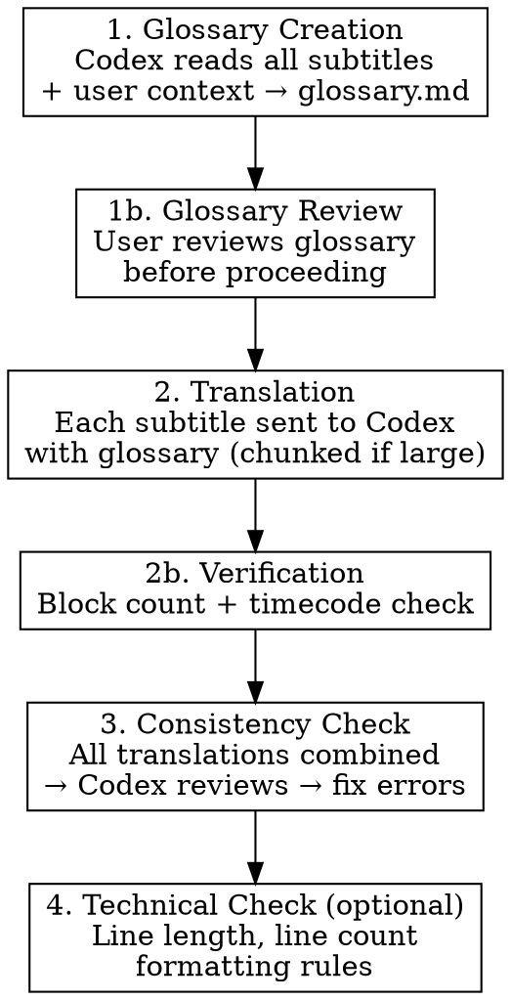

# Subtitle Translator

## Overview

Multi-phase AI subtitle translation workflow that produces natural, context-aware translations by first building a translation glossary, then translating with context, and finally running consistency and technical checks. Uses Claude Code as orchestrator and Codex CLI (`gpt-5.6-sol`) as translation engine.

## Prerequisites

- **Claude Code** installed and authenticated
- **Codex CLI** installed and authenticated (`codex` command available in terminal)
- Subtitle files placed in a working folder (supported formats: SRT, ASS, SSA, VTT, SUB, SBV)

## Codex CLI Usage

Use `codex exec` (non-interactive, one prompt then exit) with the `gpt-5.6-sol`
model. Pass subtitle content via stdin pipe and collect the clean answer with
`-o`:

```bash
# Send a file with a prompt
cat file.srt | codex exec -s read-only --skip-git-repo-check \
  -m gpt-5.6-sol -c model_reasoning_effort=high \
  -o out.txt "Your prompt here" > stream.log 2>&1

# Send multiple files
cat glossary.md file.srt | codex exec -s read-only --skip-git-repo-check \
  -m gpt-5.6-sol -c model_reasoning_effort=high \
  -o out.txt "Your prompt here" > stream.log 2>&1

# Send a plain prompt (no piped content) - stdin MUST be closed
codex exec -s read-only --skip-git-repo-check -m gpt-5.6-sol \
  -o out.txt "Your prompt here" < /dev/null > stream.log 2>&1
```

Then read the translated result from `out.txt`.

**Flags that matter:**
- `-m gpt-5.6-sol` - the translation model. `-c model_reasoning_effort=high`
  gives noticeably better prose; drop to `medium` if runs are too slow.
- `-o <file>` - writes the clean final message to a file. **Always use this.**
  Raw stdout is an interleaved event stream and is painful to parse.
- `-s read-only` - Codex never edits files. Claude Code writes all output files.
- `--skip-git-repo-check` - needed when the subtitle folder is not a git repo.
- `-C <dir>` - set the working root if you need Codex to resolve relative paths.

**🔴 Stdin gotcha:** `codex exec` reads stdin and hangs forever if stdin stays
open. A `cat ... |` pipe closes it correctly. Any run *without* a pipe must
redirect `< /dev/null`.

**Long runs:** A full-episode translation at high reasoning effort takes
several minutes. Run it in the background and poll for the `-o` file instead of
blocking; if the process exits with no `-o` file, the error is in the stream log.

## 🔴 Native Characters Rule

**Every output must be written with the target language's own characters — never
an ASCII-folded approximation.** This applies to *all* generated text: the
glossary, the translated subtitle files, and the consistency-check output.

| Language | Required | Never |
|----------|----------|-------|
| Turkish | çğıöşü ÇĞİÖŞÜ | `Turkce Ceviri Sozlugu`, `ISIMLERI` |
| German | äöüß | `Strasse`, `ueber` |
| French | àâçéèêëîïôùûü | `francais`, `eleve` |
| Spanish | áéíñóúü¿¡ | `espanol`, `anos` |
| Polish | ąćęłńóśźż | `zolw`, `Lodz` |
| Russian, Greek, Japanese, … | native script | Latin transliteration |

Note the Turkish dotted/dotless pair specifically: `I`/`ı` and `İ`/`i` are four
distinct letters. `Istanbul` is wrong; `İstanbul` is right.

**Put this instruction in every Codex prompt, explicitly**, e.g.:

> Write the output in <language> using full native orthography and all its
> diacritics. Never substitute ASCII look-alikes (no `c` for `ç`, no `s` for
> `ş`, no `i` for `ı`). Output must be UTF-8.

Also write every file as UTF-8 (no BOM). Never pass generated text through
`iconv //TRANSLIT`, `unidecode`, or any similar ASCII-folding step.

## Workflow



### Phase 1: Glossary Creation

**Before starting, ask the user (if not already provided):**
- What is the target language?
- What show/movie is this? (title, genre, setting, time period)
- Any character details? (names, relationships, bios)
- Any specific terminology, slang, or invented words?
- What tone? (formal, casual, comedic, dark)
- Timecode mode: **preserve** (keep original timecodes) or **retimed** (adjust timecodes for the target language)?
- Should song lyrics be translated or left in the original language?

Use whatever context the user provides to enrich the glossary prompt.

Send each subtitle file to Codex individually for term extraction (do not concatenate all files into one prompt). Then send all extracted terms to Codex to produce a unified glossary.

The glossary must itself be written in the target language's native characters — see
[Native Characters Rule](#-native-characters-rule). A glossary that spells names
ASCII-only teaches every later phase to do the same.

Save the glossary as `glossary.md` in the working folder. The glossary should contain:
- Character name spellings and pronunciation notes
- Recurring terms with agreed translations
- Tone and style guidelines
- Show-specific context

### Phase 1b: Glossary Review

**Present the glossary to the user for review before proceeding.** The user may want to correct character names, adjust term translations, or add missing context. Fix any issues before moving to Phase 2.

### Phase 2: Translation

Send each subtitle file to Codex one by one, along with the glossary.

**Chunking strategy:** For files with more than 300 subtitle blocks, split into chunks of ~250 blocks each. Translate each chunk separately with the glossary, then combine the results. This prevents output truncation from output length limits.

**Key translation principles:**
- Natural, fluent target language
- **Full native orthography** — every diacritic and non-Latin character the target
  language uses, never an ASCII substitute (see [Native Characters Rule](#-native-characters-rule))
- Context-aware (follows glossary terms)
- Easy to read on screen (subtitle-friendly phrasing)
- Preserve all formatting tags (`{\an8}`, `<i>`, `<b>`, `<font>`, etc.) exactly as-is
- Song lyrics: follow the user's preference from Phase 1

**Timecode modes:**
- **Preserve**: Keep original timecodes exactly as-is. Translate text only. Best when the source timing already works well.
- **Retimed**: Rewrite timecodes to fit the target language. Allows splitting or merging subtitle blocks when the translation is significantly shorter or longer than the original. Best for languages with very different sentence lengths.

**Output file naming:** Replace the source language code with the target language code in the filename. Example: `Show.en.srt` → `Show.tr.srt`

**Rate limits:** Codex CLI may hit usage/quota limits or transient 429 errors on long batches. This is normal. Wait a few seconds and retry automatically. If the output says authentication or login is required, Codex's auth has lapsed - ask the user to run `codex` interactively to sign in (suggest `! codex`), then resume.

### Phase 2b: Verification

After translating each file, verify:
- Subtitle block count matches the original (in preserve mode)
- All timecodes are present and correctly formatted
- No formatting tags were removed or corrupted
- No empty subtitle blocks
- **Native characters are present and not ASCII-folded**, and the file is valid UTF-8

Character check — for a language with non-ASCII letters, a translated file that
contains none of them is a red flag:

```bash
# Does the output actually carry the target language's characters?
grep -c '[çğıöşüÇĞİÖŞÜ]' Show.tr.srt        # Turkish - must be well above 0
grep -n '[^[:print:][:space:]]' Show.tr.srt  # spot mojibake / bad encoding
file -I Show.tr.srt                          # expect charset=utf-8
```

Swap the bracket set for the target language's own letters. If the count is 0 or
implausibly low, the model ASCII-folded the output — re-run that file (or chunk)
with the charset instruction stated more forcefully, don't patch it by hand.

Fix any issues before proceeding.

### Phase 3: Consistency Check

Combine all translated subtitle files and send them back to Codex for review:
- Term consistency across episodes
- Character voice consistency
- Glossary adherence
- Contextual accuracy
- Correct native characters throughout (no ASCII-folded words left behind)

Errors found are automatically corrected.

### Phase 4: Technical Check (Optional)

Common subtitle technical rules:
- Max characters per line (e.g., 25-42 depending on platform)
- Max 2 lines per subtitle block
- Minimum display duration (typically 1 second)
- No orphan words on second line

## Quick Reference

| Phase | What | Tool | Output |
|-------|------|------|--------|
| 1. Glossary | Read all subtitles + context → build term dictionary | Codex CLI | `glossary.md` |
| 1b. Review | User reviews and corrects glossary | User | Updated `glossary.md` |
| 2. Translate | Each subtitle + glossary → translated subtitle (chunked) | Codex CLI | Translated files (same format) |
| 2b. Verify | Block count, timecodes, tags check | Claude Code | Verified files |
| 3. Consistency | All translations → review & fix | Codex CLI | Fixed subtitle files |
| 4. Technical | Format checks (line length, count) | Claude Code | Validated subtitle files |

## Tips

- **Batch by season**: Keep one folder per season for manageable glossary scope
- **Glossary is key**: The better your context input (character bios, show details), the better the translations
- **Iterate glossary**: After Phase 3, update the glossary with any new terms discovered during consistency check

## Common Mistakes

| Mistake | Fix |
|---------|-----|
| Skipping glossary phase | Always build glossary first - it prevents inconsistent character names and terms across episodes |
| Sending all subtitles at once for translation | Send one by one with glossary - prevents context window overflow and improves quality |
| Not chunking large files | Files over 300 blocks should be split into ~250-block chunks to avoid output truncation |
| Leaving stdin open on `codex exec` | Pipe input with `cat ... \|` or redirect `< /dev/null` - otherwise it hangs forever with no output |
| Parsing raw stdout | Use `-o <file>` for the clean answer; stdout is a noisy event stream |
| Not providing show context | Character bios, setting, tone info dramatically improve translation quality |
| ASCII-folding the output (`Turkce` instead of `Türkçe`) | State the native-characters requirement in every Codex prompt and verify with `grep -c` after each file |
| Confusing Turkish `I`/`ı` and `İ`/`i` | They are four separate letters - `İstanbul`, not `Istanbul` |
| Stripping formatting tags | Preserve `{\an8}`, `<i>`, `<b>` and other tags - they control subtitle positioning and style |
| Ignoring technical limits | Platform subtitle rules (char limits, line counts) affect readability |
| Not verifying output | Always check block count and timecodes match the original after translation |
| Ignoring rate limits | Codex 429/quota errors are normal - retry after a few seconds |
